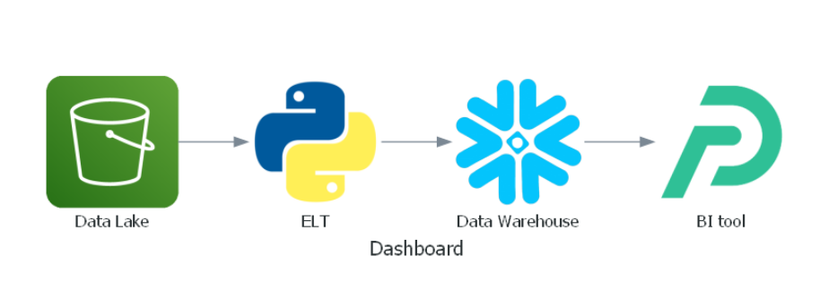
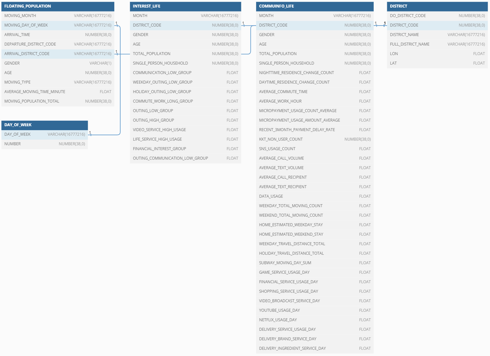
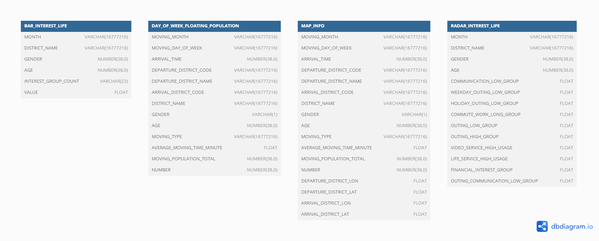
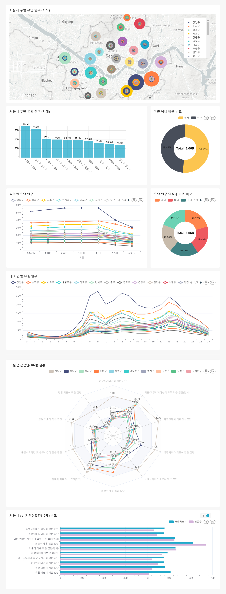

# 서울시 구별 유출 인구 원인 분석
## 1. 프로젝트 개요

- 서울 열린데이터 광장에서 ‘서울 생활이동’와 ‘서울 시민생활’  데이터들을 가지고, 전처리(파이썬)와 데이터 웨어하우스(Snowflake) 를 사용하여 데이터셋을 구성한 뒤, 대시보드(Preset.io) 를 생성합니다.
- 사용자들은 이 대시보드의 각 자치구별, 성별, 연령별 필터를 적용하여 서울 시민들의 이동 패턴이 어떻게 되는지 확인할 수 있습니다.
## 2. 프로젝트 세부 결과

0) 작업 프로세스

- ELT 파이썬 가공
    - Extract : 서울시 열린 데이터광장에서 제공하는 데이터 가져옴
    - Load : 전처리한 CSV 파일 DataWarehouse: Snowflake에 RAW_DATA 테이블로 생성
    - Transaction : 원천 데이터 파이썬 전처리 통해 필요한 컬럼만 CSV 파일로 생성
- SQL
    - Snowflake : RAW_DATA 테이블 기반, 쿼리문으로 ANALYTICS 테이블들 생성
    - Snowflake : ANALYTICS 테이블→ Preset 으로 데이터셋 로드
- BI
    - Preset으로 로드해온 데이터 기반, 대시보드 차트 구성

### 1) raw_data
- 서울 생활이동 데이터 : https://data.seoul.go.kr/dataVisual/seoul/seoulLivingMigration.do
    - 설명 : **서울 안에서 이동하거나 서울 외부에서 서울로 오고 간 이동으로 통근, 통학, 쇼핑, 여가 등 행정수요를 유발하는 모든 이동**
    - 2023.01 ~ 2023.09

- 서울 시민생활 데이터 : https://data.seoul.go.kr/dataVisual/seoul/seoulLiving.do
    - 설명: **서울시와 SK텔레콤이 공공빅데이터와 통신데이터 가명결합을 통해 추정한 서울 행정동단위 성, 연령별 1인가구와 서울시민의 생활특성 정보**
    - 2023.01 ~ 2023.09
- ERD
    - RAW_DATA
    
    
    - ANALYTICS
    
### 2) 데이터 전처리

- 서울 생활이동 데이터
    1. 연월 Column 변경
        - 월로 변경
        - 유동 월(Varchar) : 01, 02, 03, …
    2. 유동요일 Column
        - 한글에서 영문 약자(MON, TUE, WED, …)로 변경
    3. 성별 Column
        - 숫자로 변환 및 통일
        - 남자 → 0
        - 여자 → 1
    4. 나이 Column
        - 5단위 나이값을 같은 십의자리 가지는 데이터와 합침(ex : 20 + 25, 30 + 35, …)
        - 20대 미만 삭제 : 서울 시민생활 데이터와 통일
        - 70대 이상 삭제 : 조사된 표본 값이 매우 적음
    5. 인구 수 Column
        - 나이 column이 합쳐짐에 따라 나이대에 다한 인구 수의 합을 사용
        - 정수형으로 변환 : KT 사용자에 대한 인구 수에 따라 모집단의 값을 추청했기 때문에 소수점 자리인 것을 확인
- 서울 시민생활 데이터
    1. 월 Column 추가
        - 데이터 파일이 월별로 나누어져 있음
        - Varchar : 01, 02, 03, …
    2. 법정동코드 Column 변경
        - 행정안전부에서 제공하는 최신 서울특별시 자치구&행정동 코드 참고
        - 행정동, 자치구 컬럼 삭제 : DISTRCT 테이블을 생성하여 JOIN
    3. GROUP BY 
        - 레코드가 행정동 기준으로 생성되었기 때문에 자치구로
        - GROUP BY Column : 월, 행정동코드, 성별, 연령대
    4. 성별 Column
        - 숫자로 변환 및 통일
        - 남자 → 0
        - 여자 → 1
    5. 연령대 Column 범주 변경
        - 5단위 나이값을 같은 십의자리 가지는 데이터와 합침(ex : 20 + 25, 30 + 35, …)
        - 70대 삭제 : 조사된 표본 값이 매우 적음
    6. 총 인구수, 1인가구수 Column
        - 소수부분 버림
### 3) 데이터 웨어하우스

- Snowflake 사용
    - 한 명의 관리자 아이디로 공통 사용
- 데이터 업로드 방법
    1. 50MB 이하 : CSV 파일 직접 업로드
    2. 50MB 초과 : S3를 사용하여 업로드

4) 대시보드 

### 5) 데이터 분석 내용

- 요일별 유출 인구와 시간대별 유출 인구를 비교하여, 인구의 이동 원인에 대해 추측할 수 있다.
- 구별 유출 인구의 나이대 정보를 파악하여, 구 마다의 인구 특성 파악이 가능.
- 각 자치구의 관심집단을 서울시 전체 데이터와의 비교를 통해 파악가능하다.

## 3. 참여자 정보 및 각 역할

- 장태수 : DW & BI & Github 환경 설정 , 대시보드 생성
- 김바롬 : 데이터 수집 및 전처리 , 대시보드 생성
- 박단이 : 데이터 수집 및 전처리 , 대시보드 생성
- 임동빈 : ERD, 데이터 수집, 대시보드 생성

## 4. 활용 기술 및 프레임워크

- 데이터 전처리
    - Python
- Data Lake
    - S3
- Data Warehouse
    - Snowflake
- BI
    - Preset

